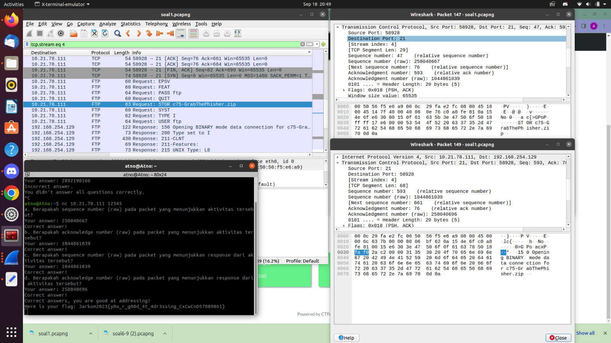
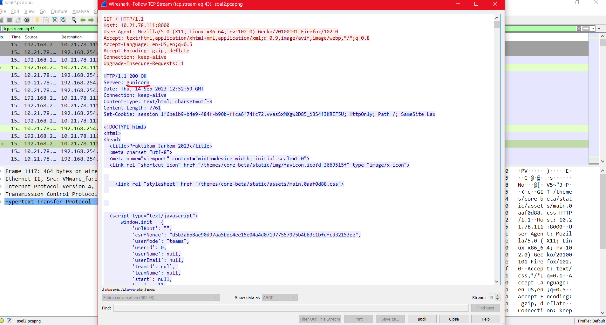
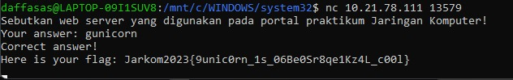

# Jarkom-Modul-1-D24-2023
Laporan Praktikum Kelas Jaringan Komputer 2024
Kelompok D24.

<ul>
  <li>Daffa Saskara - 5025211249</li>
  <li>Arun</li>
</ul>

## No1
### Penyelesaian

Dari packet yang ter-capture kita menemukan bahwa perintah yang dilakukan oleh user adalah STOR (mengunggah file). Setelah membuka packet tersebut, dengan cara klik kanan 2 kali, kita dapat menemukan sequence dan acknowledge number (raw) dan jika kita melakukan klik kanan kemudian ```follow``` -> ```TCP Stream``` kita dapat melihat Response yang didapat kemudian dengan cara yang sama kita dapat melihat sequence dan acknowledge number (raw)-nya

### Kendala
Tidak ada

## No2
### Penyelesaian

Menggunakan filter ```http contains 10.21.78.111``` klik kanan, dan ```follow``` -> ```TCP Stream```
Dan akan muncul informasi Server menggunakan ```gunicorn``` seperti pada di gambar.
<br>
<br>


### Kendala
Tidak ada.

## No3
### Penyelesaian
### Kendala
## No4
### Penyelesaian
### Kendala
## No5
### Penyelesaian
### Kendala
## No6
### Penyelesaian
### Kendala
## No7
### Penyelesaian
< img src="assets/no7-jarkom1(2).jpg" width="900" >
< img src="assets/no7-jarkom1.jpg" width="900" >
Menggunakan filter “ip.dst == 184.87.193.88”, dan ditampilkan 6 pckg.
### Kendala
## No8
### Penyelesaian
### Kendala
## No9
### Penyelesaian
### Kendala
## No10
### Penyelesaian
### Kendala
